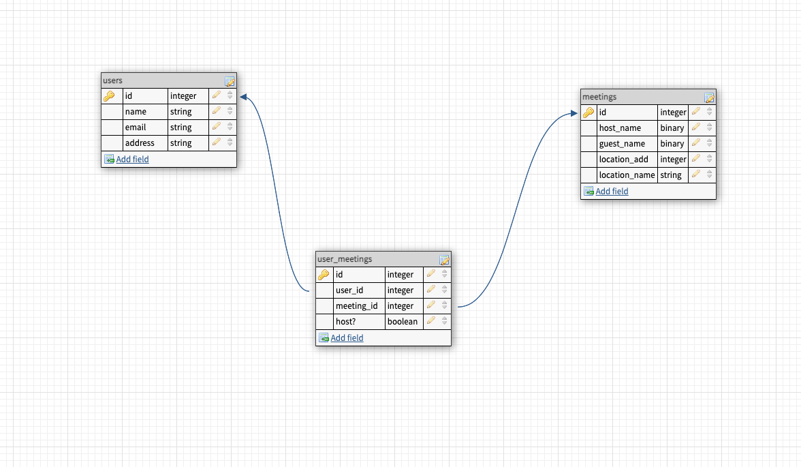

# Meet In the Middle Back End Repo


## Table of Contents
- [App](#app)
- [Background](#background)
- [Schema](#schema)
- [Endpoints](#endpoints)
- [Requirements](#requirements)
- [Setup](#setup)
- [Contributors](#contributors)

## App

Meet Me in the Middle app can be found on [heroku](https://mmim.herokuapp.com/).

## Background

The Meet Me in the Middle back end repository supports the front end repository by accessing Google Maps and sending that information to the front end to be displayed to the user. The back end also keeps track of the database that the app uses in order to track users and meetings.

## Schema



## Endpoints

- Take address and get latitude and longitude.
```shell
GET https://maps.googleapis.com/maps/api/geocode/json?address={address}
```

- Search for nearby locations.
```shell
GET https://maps.googleapis.com/maps/api/place/nearbysearch/json?location={coord}&type={category}&rankby=distance
```

## Requirements

Note: You must also install and run [mmie_fe](https://github.com/MMIM-Turing/mmim_fe) for full functionality.

### API
Go to [Google](https://developers.google.com) and follow instructions for Google Developer setup and to create an API key.

## Setup
1. Clone this repository: On your local machine, open a terminal session and enter the following commands for SSH or HTTPS to clone the repo.

- using SSH key <br>
```shell
$ git clone git@github.com:MMIM-Turing/mmim_be.git
```

- using HTTPS <br>
```shell
$ git clone https://github.com/MMIM-Turing/mmim_be.git
```

- Once cloned, you'll have a new local copy in the directory you ran the clone command in.

2. Change to the project directory: In terminal, use `$cd` to navigate to the project directory.
```shell
$ cd mmim_be
```

3. Install required Gems utilizing Bundler: <br>
- In terminal, use Bundler to install any missing Gems. If Bundler is not installed, first run the following command.
```shell
$ gem install bundler
```

- If Bundler is already installed or after it has been installed, run the following command.
```shell
$ bundle install
```

4. Database Migration<br>
- Before using the web application you will need to setup your databases locally by running the following command
```shell
$ rails db:{drop,create,migrate,seed}
```
5. Run Figaro
```shell
$ bundle exec figaro install
```
- That will create an `config/application.yml` file.

- Add your Google api to new this new file.
```shell
#config/application.yml
google_maps_api_key: 'your google key here'
```

6. Startup and Access<br>
- Finally, in order to use the web app you will have to start the server locally and access the app through a web browser.

- Start server
```shell
$ rails s
```
- Note: You must run mmie_fe server simultaneously.

- Open web browser and visit link
    http://localhost:5000 <br><br>


## Contributors
|  | |
| --- | --- |
| Joseph Downs | [GitHub](https://github.com/josephdowns) &#124; [LinkedIn](https://www.linkedin.com/in/josdowns/) |
| Kim Guo | [GitHub](https://github.com/kg-byte) &#124; [LinkedIn](https://www.linkedin.com/in/kim-guo-5331b4158/) |
| John Hennerich |[GitHub](https://github.com/jhennerich) &#124; [LinkedIn](https://www.linkedin.com/in/john-hennerich/) |
| Will Medders | [GitHub](https://github.com/wmedders21) &#124; [LinkedIn](https://www.linkedin.com/in/will-medders-781a80232/) |
| Oscar Santos | [GitHub](https://github.com/Oscar-Santos) &#124; [LinkedIn](https://www.linkedin.com/in/oscar-santos-perez/) |
|Max Wagner | [GitHub](https://github.com/MWagner3) &#124; [LinkedIn](https://www.linkedin.com/in/maximilian-wagner3350/)|
